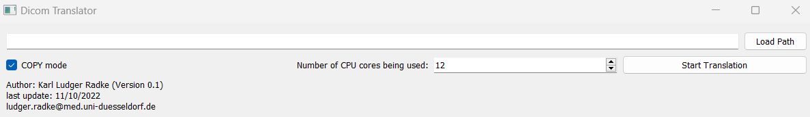

# DICOM Translator
This Python script is used to move or copy DICOM files from one directory to another, saving each file in a new directory with the patient, exam date and sequence name and Dicom image number.



**For example**, a file named **"IM-0001-0001.dcm"** could be renamed **"John_Doe/20221008_1019/CT_Scan/CT_San_dym_00001.dcm"** if the patient's name is "John Doe", the exam date is 10/08/2022 at 10:19 AM, and the sequence name is "CT_scan".

## Required libraries and Python version
- **Python:** 3.10+
- PyQt5
- tqdm
- pydicom
- win32ui
- ctypes

```basch
pip install -r requirements.txt
```

## Usage (with Python)
1. Start the script and select the path where the DICOM files are located.

```basch
python DICOMTranslator.py
```

2. Select whether the files should be copied or moved.
3. Select the number of CPU cores to be used for the operation.
4. Click Start Translation to start the operation.

When the process is complete, a message is displayed indicating the duration and the number of files recognized.

## Usage (as .exe)

1. Under the following Links ([one_dir_exe](https://uni-duesseldorf.sciebo.de/s/pPlCalVgMhaUmn4), [one_file_exe]()) you can download the DICOMTranslator as exe.
2. If you use the one_dir_exe select the folder
3. Click on the exe (DicomTranslator.exe), then the application starts
4. Select whether the files should be copied or moved.
5. Select the number of CPU cores to be used for the operation.
6. Click Start Translation to start the operation.

When the process is complete, a message is displayed indicating the duration and the number of files recognized.

## Notes
Non-DICOM files are not moved or copied.
When working in "MOVE" mode, the original directory is deleted after the operation is completed.
When working in "COPY" mode, the original directory is retained.

## License
[GNU General Public License 3](https://www.gnu.org/licenses/gpl-3.0.html)

The GNU General Public License is a free, copyleft license for software and other kinds of works.

### Git hocks
Install "pre-commit"
```bash
pip install pre-commit
```

then run:
```bash
pre-commit install
```
