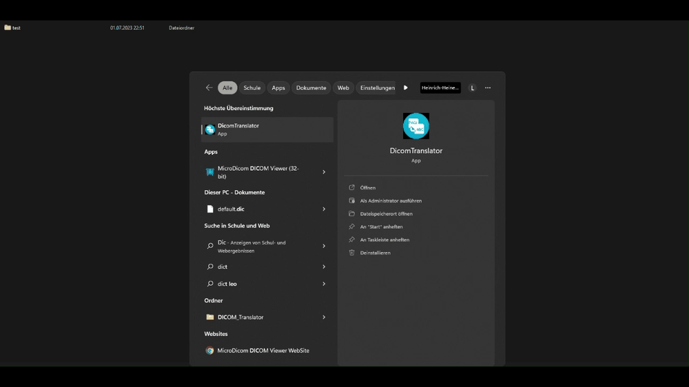

# DICOM Translator

DICOM Translator is a Python-based tool designed to efficiently move or copy DICOM files from one directory to another. It organizes each file into a new directory structure based on the patient's name, exam date, sequence name, and DICOM image number. This utility simplifies the management of DICOM files, making it an invaluable tool for healthcare professionals and researchers dealing with medical imaging data.



**Example**: A file named `IM-0001-0001.dcm` could be renamed to `John_Doe/20221008_1019/CT_Scan/CT_Scan_dym_00001.dcm` if the patient's name is "John Doe", the exam date is October 8, 2022, at 10:19 AM, and the sequence name is "CT_Scan".

## Requirements

- **Python:** Version 3.10 or newer
- PyQt6
- tqdm
- pydicom
- ctypes

To install the required libraries:

```bash
pip install -r requirements.txt
```

## Usage

### Running with Python

1. Start the script and select the directory where the DICOM files are located.

    ```bash
    python DICOMTranslator.py
    ```

2. Choose whether the files should be copied or moved.
3. Select the number of CPU cores to be used.
4. Click "Start Translation" to initiate the process.

Upon completion, a message will display the operation's duration and the number of files processed.

### Executables

The DICOM Translator is available as a standalone executable for Windows, macOS, and Linux, eliminating the need for a Python environment setup.

#### Windows

- **Standalone Executable**: Download from the [latest GitHub release](https://github.com/MPR-UKD/DICOM_Translator/releases/latest).
- **Installer**: Additionally, a Windows installer is available for a more traditional setup. It can be found in the same [releases section](https://github.com/MPR-UKD/DICOM_Translator/releases/latest).

#### macOS

- **.app Executable**: macOS users can download a `.zip` file containing the `.app` from the [latest GitHub release](https://github.com/MPR-UKD/DICOM_Translator/releases/latest). Extract the `.zip` file and open the application by double-clicking on `DicomTranslator.app`.

#### Linux

- **Executable**: Linux users can download the executable directly from the [latest GitHub release](https://github.com/MPR-UKD/DICOM_Translator/releases/latest).

## License

DICOM Translator is released under the [GNU General Public License 3](https://www.gnu.org/licenses/gpl-3.0.html), a free, copyleft license for software and other kinds of works.

## Contributing

Contributions to the DICOM Translator are welcome! If you have suggestions for improvements or encounter any issues, please feel free to open an issue or submit a pull request.

### Pre-commit Hooks

To ensure code quality and consistency, install pre-commit hooks:

```bash
pip install pre-commit
pre-commit install
```

## Support

If you find the DICOM Translator helpful, consider starring the repository on GitHub. This helps increase its visibility and reach more users interested in DICOM file management.
